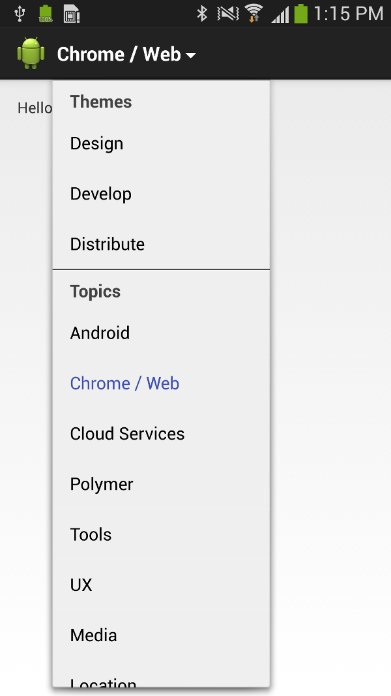
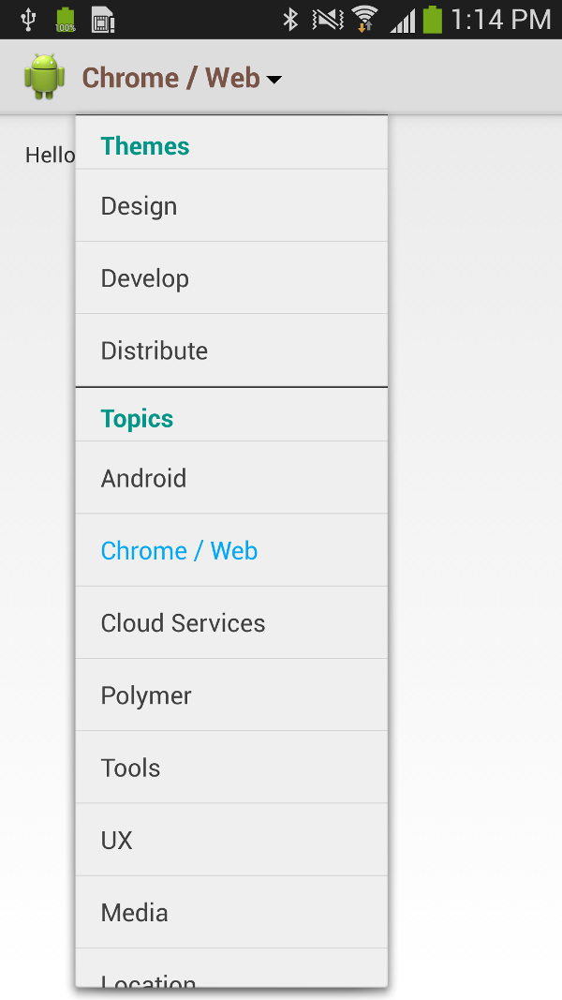

[](https://android-arsenal.com/details/1/1287)

<h1>SectionedActionBarList</h1>
<hr/>

A lightweight Android library that allows the drop down navigation list items to be grouped in sections. It was inspired from the Google I/O 2014 app how sessions are grouped in the ActionBar list. 



<h3>Example</h3>
The default usage looks like this:
```java
List<Section> sections = new ArrayList<Section>();

Section themes = new Section("Themes");
themes.add("Design");
themes.add("Develop");
themes.add("Distribute");
sections.add(themes);

Section topics = new Section("Topics");
topics.add("Android");
topics.add("Chrome / Web");
topics.add("Cloud Services");
topics.add("Media");
topics.add("Location");
topics.add("Performance");
sections.add(topics);

Section types = new Section("Types");
types.add("Sessions");
types.add("App Reviews");
types.add("Box Talks");
sections.add(topics);

SectionedActionBarList actionBarList = new SectionedActionBarList(this).from(sections);
actionBarList.setItemSelectedListener(new ItemSelectedListener() {
  @Override
  public void onItemSelected(AdapterView<?> parent, View view, int position, long id, String sectionName, String itemName) {
      Toast.makeText(MainActivity.this, "Section: " + sectionName + ", Item: " + itemName, Toast.LENGTH_LONG).show();
  }
});
```
<h3>Configuration</h3>
Small customizations can be done to fit with your application design:
```java
ListConfiguration configuration = new ListConfiguration(this);
configuration.setActionBarItemColorResource(R.color.brown);
configuration.setIndicatorDrawableResource(R.drawable.spinner_indicator_dark);
configuration.setSectionTitleColorResource(R.color.teal);
configuration.setDropdownItemColorResources(R.color.light_blue, R.color.dark_grey);

SectionedActionBarSpinner actionBarSpinner = new SectionedActionBarSpinner(this, configuration).from(sections);
// ....
```



License
-------

    Copyright 2015 - 2016 Veaceslav Grec

    Licensed under the Apache License, Version 2.0 (the "License");
    you may not use this file except in compliance with the License.
    You may obtain a copy of the License at

        http://www.apache.org/licenses/LICENSE-2.0

    Unless required by applicable law or agreed to in writing, software
    distributed under the License is distributed on an "AS IS" BASIS,
    WITHOUT WARRANTIES OR CONDITIONS OF ANY KIND, either express or implied.
    See the License for the specific language governing permissions and
    limitations under the License.
